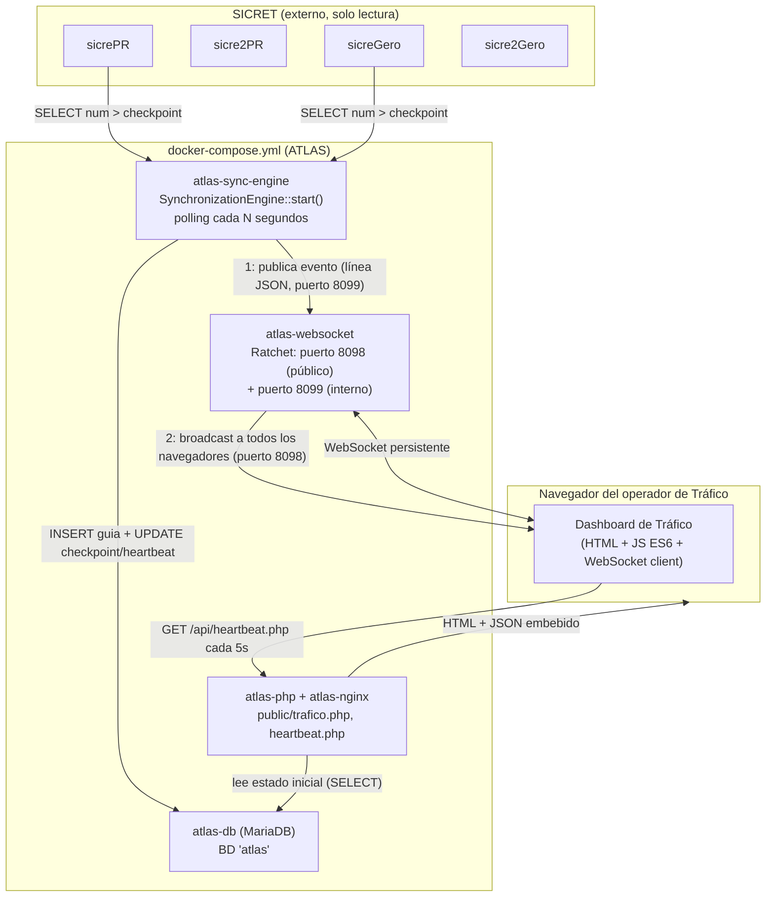
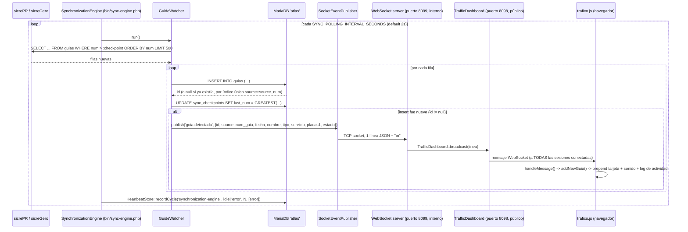

# Arquitectura — ATLAS

## 1. Naturaleza del proyecto

PHP 8.3 orientado a objetos, con autoload **PSR-4 real vía Composer**
(`"App\\": "app/"`, ver `composer.json`) — a diferencia del Sistema de
Guías, aquí sí hay gestión formal de dependencias (`composer.lock` incluye
`cboden/ratchet`, y transitivamente `react/*`, `symfony/*`, `guzzlehttp/*`,
`psr/*`, `evenement/*`). No es un framework MVC de propósito general: es un
conjunto pequeño y específico de servicios (Synchronization Engine,
WebSocket server, Dashboard) que comparten una única base de datos propia.

No hay:
- Autenticación/sesiones/usuarios (confirmado, sin `session_start()` ni
  tablas de usuarios).
- Router HTTP genérico — cada script en `public/` es autocontenido y hace
  su propio `require __DIR__ . '/../vendor/autoload.php'` más su propia
  lógica; no hay un front controller único como en el Sistema de Guías.
- ORM — acceso a datos 100% PDO preparado, manual, por repositorio.
- Motor de vistas — `resources/views/trafico.php` es PHP puro con
  variables inyectadas por `include`, igual de simple que en el Sistema de
  Guías, pero aquí es el único archivo de vista que existe todavía.

## 2. Los tres procesos independientes de ATLAS

ATLAS no es "una aplicación" en el sentido clásico de petición-respuesta:
son **tres procesos Docker de larga vida** más el servidor web tradicional,
todos compartiendo la misma base de código pero ejecutando entry points
distintos:

| Contenedor | Comando | Rol |
|---|---|---|
| `atlas-nginx` | nginx | Sirve `public/` (HTTP tradicional, petición-respuesta) |
| `atlas-php` | php-fpm | Ejecuta `public/index.php`, `public/trafico.php`, `public/api/heartbeat.php` bajo demanda de nginx |
| `atlas-websocket` | `php bin/websocket-server.php` (long-running, bucle de evento ReactPHP) | Servidor Ratchet: acepta conexiones WebSocket de navegadores (puerto 8098) y un canal interno de publicación (puerto 8099) |
| `atlas-sync-engine` | `php bin/sync-engine.php` (long-running, bucle `while(true)` + `sleep()`) | Polling continuo contra SICRET, inserción en `atlas`, publicación de eventos hacia el WebSocket server |
| `atlas-db` | `mariadb:11` | Base de datos propia `atlas` |

Es una arquitectura de **polling + pub/sub interno**, no de triggers de
base de datos ni de un message broker externo (no hay RabbitMQ/Redis/Kafka
en este proyecto).

## 3. Diagrama de componentes



## 4. Ciclo de vida de un evento (el único que existe hoy: `guia.detectada`)



Puntos de diseño importantes:
- **El checkpoint solo avanza tras confirmar la inserción** (o confirmar
  que ya existía) — nunca tras solo leer. Esto es explícito en el
  comentario de `GuideWatcher::syncSource()`.
- **La publicación del evento (paso a WebSocket) es "best effort"**: si
  falla la conexión TCP al publicador interno, `SocketEventPublisher` solo
  registra un error en el log — **nunca** revierte ni bloquea la
  sincronización. La base de datos de ATLAS ya es la fuente de verdad; el
  WebSocket es solo una notificación adicional en tiempo real.
- **Primera ejecución por fuente** (`checkpoint === 0`): el `GuideWatcher`
  agrega `AND fecha >= :today` a la consulta — es decir, en el primer
  arranque contra una fuente nueva, ATLAS solo trae las guías **del día
  en curso**, no el histórico completo de SICRET.
- **Procesamiento en lotes de 500** (`BATCH_SIZE`), con un `do...while` que
  repite mientras el lote venga lleno — para ponerse al día rápido si hay
  muchas guías pendientes.

## 5. Inyección de dependencias — manual, sin contenedor

No hay un Service Container (no Symfony DI, no PHP-DI). Cada script en
`bin/` y `public/` construye a mano el árbol de dependencias con `new`
directo (ver `bin/sync-engine.php`, `public/trafico.php`) — es
"constructor injection" clásico sin autowiring automático. Es coherente con
el tamaño actual del proyecto, pero es un punto a vigilar si el número de
componentes crece (ver `improvement_notes.md`).

## 6. Estructura de carpetas

```
tablero-guias/
├── app/
│   ├── Config/Config.php            # Lectura de variables de entorno (getenv)
│   ├── Database/ConnectionFactory.php  # Construye PDO hacia cualquier MySQL (ATLAS o SICRET)
│   ├── Sync/                        # El "Synchronization Engine" completo
│   ├── Dashboard/                   # Repositorios de solo lectura para la UI
│   └── WebSocket/TrafficDashboard.php  # Componente Ratchet (implementa MessageComponentInterface)
├── bin/
│   ├── sync-engine.php              # Entry point del proceso de sincronización
│   ├── websocket-server.php         # Entry point del servidor Ratchet
│   ├── migrate.php                  # Aplica database/schema.sql tal cual (sin control de versiones de migraciones)
│   └── check-connections.php        # Diagnóstico manual: prueba las 5 conexiones (ATLAS + 4 SICRET)
├── config/sources.php                # Declara qué fuentes SICRET vigila el GuideWatcher
├── database/schema.sql                # Único archivo de esquema (no hay migraciones incrementales)
├── public/
│   ├── index.php                     # Placeholder — solo hace `echo` de un string
│   ├── trafico.php                   # Entry point real del Dashboard de Tráfico
│   └── api/heartbeat.php             # Único endpoint HTTP de datos (JSON)
├── resources/views/trafico.php        # Única vista HTML
└── docs/                              # Documentos de diseño funcional (ver overview.md)
```

## 7. Infraestructura Docker

`docker-compose.yml`: 5 servicios (`nginx`, `php`, `db`, `websocket`,
`sync-engine`), todos construidos desde el mismo `docker/Dockerfile`
(`php:8.3-fpm` + extensión `pdo_mysql` + Composer copiado desde la imagen
oficial de Composer) salvo `nginx` (imagen oficial) y `db` (`mariadb:11`
oficial). No hay Redis ni ninguna otra pieza de infraestructura adicional.

Puertos publicados al host (confirmados también en `docker ps` en vivo):
`8097` (nginx→80), `8098` (WebSocket público), `3311` (MariaDB de ATLAS,
mapeado desde 3306). El puerto interno `8099` (publicación
sync-engine→websocket) **no se expone al host** — solo es alcanzable entre
contenedores de la misma red Docker, por diseño.

Las 4 bases de SICRET son siempre externas a este `docker-compose.yml`,
alcanzadas vía IP LAN fija (`192.168.1.209:3306`, confirmado en `.env`) —
la misma IP que usa `TraficoDatabase`/`SicretGeroDatabase` en el Sistema de
Guías, reforzando que ambos proyectos apuntan al mismo servidor físico de
SICRET.

## 8. Arquitectura de Eventos, Workflows y Notificaciones

ATLAS obtiene información y genera eventos a través de dos mecanismos totalmente distintos, respetando una estricta separación de responsabilidades:

### 1. Eventos Observados (Monitor)
Estos eventos NO son enviados por FORSIS. ATLAS los descubre por sí mismo monitoreando pasivamente SICRET a través de su **Synchronization Engine (Monitor)** (`bin/sync-engine.php` y `GuideWatcher`).
- Ejemplos: `GuideCreated`, `GuideUpdated`, `GuideCancelled`.
- **Flujo:** SICRET → Monitor (GuideWatcher) → Genera Evento de Dominio (`GuideCreated`) → Dispatcher.

### 2. Acciones de Workflow (API)
Acciones que representan decisiones humanas y no pueden descubrirse simplemente observando la base de datos de SICRET. Estas acciones son iniciadas desde FORSIS consumiendo la **API de ATLAS**.
- Ejemplos: Solicitar Timbrado (`POST /api/solicitudes-timbrado.php`), Aprobar Liberación (`PATCH /api/solicitudes-liberacion.php`).
- **IMPORTANTE:** FORSIS **NUNCA** envía eventos prefabricados. FORSIS envía únicamente *intenciones* o *acciones de negocio*. 
- **Flujo (Responsabilidad del Runtime):**
  1. La API recibe la acción de FORSIS.
  2. Los servicios del Runtime (`SolicitudLiberacionService`, `SolicitudTimbradoService`) validan la intención y ejecutan las reglas de negocio.
  3. El Runtime actualiza los Workflows y Work Items internos en la base de datos de ATLAS.
  4. El Runtime **fabrica el Evento de Dominio internamente** (p. ej. `LiberacionApproved`).
  5. El Runtime pasa este evento al Dispatcher para notificar a los consumidores.

### Notification Dispatcher
A partir de esta alineación, ATLAS es el propietario exclusivo del sistema de notificaciones corporativas.
- El `NotificationDispatcher` se encarga de rutear un evento interno (p. ej. `GuideCreated` o `LiberacionApproved`) hacia múltiples "Consumers" (consumidores) interesados.
- Cada consumidor implementa la interfaz `EventConsumer` y declara qué eventos soporta.

#### Mattermost Consumer y Enrutamiento por Canal
La integración de Mattermost es el consumidor principal (`MattermostConsumer`). La lógica de decisión de canales se delega al `MattermostRouter`, que dictamina:
- `GuideCreated` -> `trafico`
- Eventos de Timbrado/Liberación -> `trafico`, `facturacion`

El Runtime lanza el evento, y el router decide automáticamente los canales destino de manera agnóstica a la regla de negocio original.

#### Plantillas (Templates)
Cada tipo de evento tiene su propia plantilla (`MattermostTemplate`, por ejemplo `GuideCreatedTemplate`). Esto permite ajustar el formato o mensaje final de forma independiente sin tocar la lógica de negocio ni el Dispatcher.

#### Extensibilidad
- **Nuevos eventos observados:** El Monitor los descubre y los publica al Dispatcher.
- **Nuevos eventos de workflow:** El Runtime los genera como resultado de una nueva acción en la API y los envía al Dispatcher.
- **Nuevos consumidores:** Basta con crear un nuevo componente (p. ej. `EmailConsumer` o `WebhookConsumer`) que implemente `EventConsumer`, y registrarlo en el Dispatcher, sin necesidad de modificar ni el Runtime ni la API.
