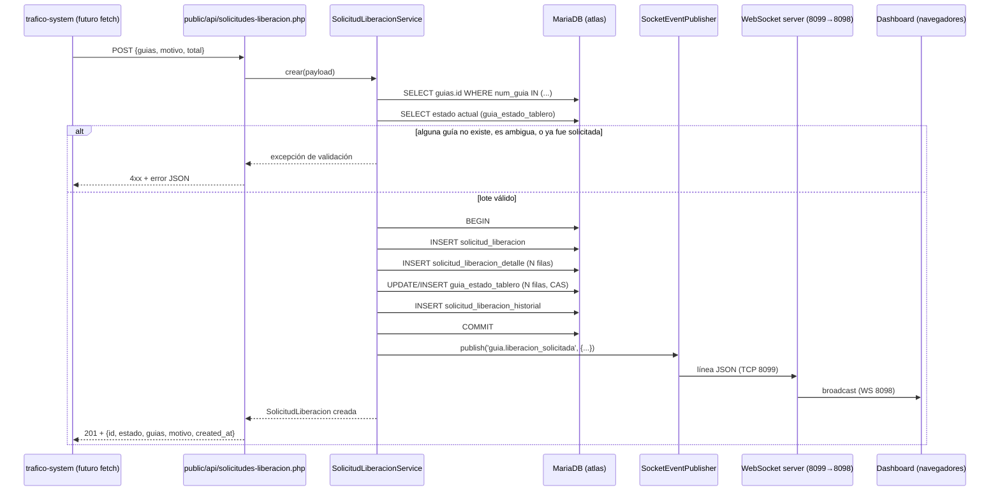

# Solicitudes de Liberación — Estados y Flujo Completo

---

## 1. Dos máquinas de estado distintas (decisión de diseño clave)

El primer hallazgo del análisis es que **"estado" significa dos cosas
distintas** en este módulo, y confundirlas fue el motivo por el que
`docs/03-ui/02-mesa-operativa-trafico.md §14` dejó la decisión de esquema
abierta. Este diseño las separa explícitamente:

1. **Estado operativo de la guía en el tablero** (`GuiaEstadoTablero.estado`)
   — en qué columna del Dashboard vive la tarjeta. Es un estado **por
   guía**.
2. **Estado de la solicitud** (`SolicitudLiberacion.estado`) — en qué punto
   del proceso de revisión está el lote. Es un estado **por lote**.

Son independientes porque una solicitud puede (en el futuro, cuando exista
Facturación) resolverse de forma distinta para guías distintas del mismo
lote — este diseño no lo impide, aunque tampoco lo implementa todavía (ver
`future-considerations.md §2`).

---

## 2. Estado operativo de la guía (`GuiaEstadoTablero`)

| Estado | ¿Implementado este sprint? | Justificación |
|---|---|---|
| `GENERADA` | Sí (implícito) | Estado por defecto de toda guía detectada por el Synchronization Engine. **No se materializa como fila** hasta la primera transición (ver `database-design.md §1`) — una guía sin fila en `guia_estado_tablero` se interpreta como `GENERADA`. |
| `SOLICITADA_LIBERACION` | Sí | Se asigna cuando una `SolicitudLiberacion` que la incluye queda registrada exitosamente. Es el único estado que este sprint sabe **escribir**. |
| `TIMBRADO_EXITOSO` | No — reservado | Pertenece al futuro `CFDIWatcher` (`docs/03-ui/01-dashboard-trafico.md §5.3`). Se documenta aquí solo para que el campo `estado` no necesite una migración de esquema distinta cuando ese módulo se construya. |
| `TIMBRADO_ERROR` | No — reservado | Idem. |

No se propone un estado de "regreso" (p. ej. `RECHAZADA` a nivel de guía)
porque `docs/03-ui/01-dashboard-trafico.md §8` es explícito: **no existe
reversión manual entre paneles**. Si Facturación rechaza una solicitud, qué
pasa con el estado de la guía era, hasta el sprint "Tablero de
Facturación", una decisión pendiente (ver `future-considerations.md §2`).

**Decisión (sprint "Tablero de Facturación")**: rechazar revierte la guía
a `GENERADA`, no a un estado terminal nuevo. `RECHAZADA` **no se agrega**
al enum de `GuiaEstadoTablero` — la única tabla que registra el rechazo es
`SolicitudLiberacion`/`SolicitudLiberacionHistorial` (§3). Justificación:
`GuiaEstadoTablero` representa "en qué columna del Dashboard vive la
tarjeta" (§1), y tras un rechazo la respuesta correcta es "de vuelta a
donde estaba, disponible para corregirse y volver a solicitarse" — no un
nuevo panel visual. Esto **no** contradice "no existe reversión manual
entre paneles" (esa regla es sobre que un operador arrastre una tarjeta
hacia atrás a mano; aquí es Facturación, un actor distinto, tomando una
decisión explícita, no deshaciendo la de otro). Implementado en
`App\Liberacion\SolicitudLiberacionService::rechazar()`, que llama
`GuiaEstadoTableroRepository::marcarEstado($guiaId, ESTADO_GENERADA)` por
cada guía del lote, dentro de la misma transacción que marca la solicitud
como `RECHAZADA`.

## 3. Estado de la solicitud (`SolicitudLiberacion`)

El enunciado del sprint propone como referencia: *Solicitada, En revisión,
Aprobada, Rechazada, Cancelada*. Análisis de cada uno:

| Estado propuesto | ¿Se adopta? | Justificación |
|---|---|---|
| **Solicitada** → renombrado **`PENDIENTE`** | Sí — es el único estado que este sprint crea | Se usa `PENDIENTE` en vez de `SOLICITADA` para no chocar semánticamente con el estado de la guía (`SOLICITADA_LIBERACION`) — son conceptos distintos (§1) y el nombre debe dejarlo claro a simple vista. |
| **En revisión** → `EN_REVISION` | Reservado, no implementado | Sigue sin usarse — el tablero de Facturación (sprint "Tablero de Facturación") resuelve directamente `PENDIENTE → APROBADA/RECHAZADA`, sin un paso intermedio explícito de "alguien empezó a revisar". El valor queda reservado por si se decide agregar ese paso más adelante. |
| **Aprobada** → `APROBADA` | **Implementado** (sprint "Tablero de Facturación") | `App\Liberacion\SolicitudLiberacionService::aprobar()`, vía `PATCH /api/solicitudes-liberacion.php`. Terminal solo en el sentido de que ya no vuelve a `PENDIENTE`; de ahí avanza a `EJECUTANDO`/`COMPLETADA`/`ERROR` por `LiberacionExecutor`/`LiberationConfirmationWatcher`. |
| **Rechazada** → `RECHAZADA` | **Implementado** (sprint "Tablero de Facturación") | `App\Liberacion\SolicitudLiberacionService::rechazar()`. Terminal de verdad — no hay transición posterior. Revierte cada guía del lote a `GENERADA` en `guia_estado_tablero` (decisión de este sprint, ver §2 arriba). |
| **Cancelada** | **No se adopta, ni siquiera reservada** | Contradice una regla de negocio ya fijada explícitamente: `docs/03-ui/01-dashboard-trafico.md §8` — "no existe mecanismo para deshacer la solicitud"; y `docs/03-ui/02-mesa-operativa-trafico.md §13.6` — "no existe botón ni mecanismo para deshacer la solicitud aquí". Agregar `CANCELADA` ahora sería diseñar para un caso que el propio negocio ya descartó. Si en el futuro se decide lo contrario, es un cambio de regla de negocio explícito (mencionado como posibilidad en el propio doc de Mesa Operativa, §8), no una omisión de este diseño — se documenta como pregunta abierta en `future-considerations.md §2`. |

**Justificación de `PENDIENTE` como único estado de escritura de este
sprint**: es el reflejo exacto de lo que ATLAS puede afirmar con certeza
hoy — "se recibió y se registró una solicitud" — sin inventar ningún
comportamiento de Facturación que no se ha diseñado.

---

## 4. Flujo completo (trafico-system → ATLAS → Facturación → Timbrado → Fin)

```
┌─────────────────────────────────────────────────────────────────────┐
│ 1. TRAFICO-SYSTEM (ya construido, fuera de este repositorio)         │
└─────────────────────────────────────────────────────────────────────┘
Operador abre /guias, selecciona 1+ guías (checkboxes), escribe motivo,
confirma en el modal "Solicitar Liberación".
        │
        │  HOY: console.log(solicitud) — no hay red de por medio.
        │  DESPUÉS de este sprint: fetch(POST) hacia el endpoint de ATLAS
        │  (cambio que le corresponde a trafico-system, no a ATLAS).
        ▼
┌─────────────────────────────────────────────────────────────────────┐
│ 2. ATLAS — recepción (ESTE SPRINT DISEÑA ESTO)                       │
└─────────────────────────────────────────────────────────────────────┘
POST /api/solicitudes-liberacion.php
        │
        ▼
SolicitudLiberacionPayload::fromArray($json)  — valida forma (§ver api-design.md)
        │
        ▼
SolicitudLiberacionService::crear($payload)
        │
        ├─ resuelve cada num_guia → guias.id de ATLAS (rechaza si no existe
        │  o es ambiguo entre sources, ver security.md §2)
        ├─ verifica que cada guía esté hoy en estado GENERADA
        │  (lectura desde GuiaEstadoTablero, con fallback a GENERADA si no
        │  hay fila) — si alguna ya fue solicitada, rechaza el LOTE COMPLETO
        │  (todo o nada, ver security.md §3)
        │
        ▼  (dentro de una transacción PDO — primera del proyecto ATLAS
        │   fuera del Sistema de Guías, mismo patrón que GuardarGuiaService)
        │
        ├─ INSERT solicitud_liberacion (estado = PENDIENTE)
        ├─ INSERT N filas en solicitud_liberacion_detalle
        ├─ UPDATE/INSERT guia_estado_tablero (compare-and-swap,
        │  GENERADA → SOLICITADA_LIBERACION, por cada guía)
        ├─ INSERT solicitud_liberacion_historial (evento = CREADA)
        │
        ▼  COMMIT
        │
        ▼
EventPublisher::publish('guia.liberacion_solicitada', {solicitud_id, guias:[...]})
        │  (después del commit — "backend persiste antes de notificar",
        │   regla ya vigente en docs/03-ui/01 §10 y §11)
        ▼
Socket TCP interno (8099) → TrafficDashboard::broadcast() (8098, sin cambios)
        │
        ▼
HTTP 201 con el recurso creado → respuesta a trafico-system
        │
        ▼
┌─────────────────────────────────────────────────────────────────────┐
│ 3. DASHBOARD DE ATLAS (frontend, no forma parte de este sprint)      │
└─────────────────────────────────────────────────────────────────────┘
trafico.js recibe el evento por WebSocket. Hoy `handleMessage()` solo
reconoce `guia.detectada` (ver `knowledge/websocket.md §4`) — agregar el
`case` para `guia.liberacion_solicitada` (mover tarjeta(s) del panel
"Guías Generadas" a "Solicitadas a Liberación") es trabajo de frontend
pendiente, fuera del alcance de este sprint de backend.
        │
        ▼
┌─────────────────────────────────────────────────────────────────────┐
│ 4. FACTURACIÓN — IMPLEMENTADO (sprint "Tablero de Facturación")      │
└─────────────────────────────────────────────────────────────────────┘
`public/facturacion.php`, alimentado por
GET /api/facturacion-solicitudes.php (vista aplanada por guía, con
filtros/orden/paginación server-side), consume las solicitudes PENDIENTE.
Aprobar/rechazar es PATCH /api/solicitudes-liberacion.php?id=
(`{"accion":"aprobar"|"rechazar", "actor", "motivo"}`) →
`SolicitudLiberacionService::aprobar()`/`rechazar()`. Publica
`solicitud_liberacion.aprobada`/`.rechazada` por WebSocket (mismo
mecanismo que `guia.liberacion_solicitada`). `EN_REVISION` sigue sin
usarse (§3) — la transición es directa `PENDIENTE → APROBADA|RECHAZADA`.
        │
        ▼
┌─────────────────────────────────────────────────────────────────────┐
│ 5. TIMBRADO / CFDIWatcher (módulo futuro, NO diseñado aquí)          │
└─────────────────────────────────────────────────────────────────────┘
Monitoreo de sistema de archivos (mencionado en CLAUDE.md como pendiente),
publicaría `timbrado.exitoso`/`timbrado.error` (nombres ya reservados en
`docs/03-ui/01-dashboard-trafico.md §7`) y actualizaría
`GuiaEstadoTablero.estado` a `TIMBRADO_EXITOSO`/`TIMBRADO_ERROR`.
        │
        ▼
┌─────────────────────────────────────────────────────────────────────┐
│ FIN DEL PROCESO                                                      │
└─────────────────────────────────────────────────────────────────────┘
La guía llega a un estado terminal en el tablero (panel "Resultado del
Timbrado"). La solicitud llega a un estado terminal (APROBADA/RECHAZADA).
Ninguno de los dos hechos ocurre en el código que produce este sprint —
este sprint entrega hasta el final del paso 2 (persistencia + notificación).
```

## 5. Diagrama de secuencia (alcance de este sprint únicamente)



## 6. Regla explícita: persistir antes de notificar

Igual que el resto de ATLAS (`docs/03-ui/01-dashboard-trafico.md §10-11`,
ya aplicado por `GuideWatcher`/`SocketEventPublisher`): la publicación del
evento ocurre **después** del `COMMIT`, nunca antes, y un fallo al publicar
**no revierte** la transacción — el evento es una notificación best-effort,
la base de datos de ATLAS es la fuente de verdad. Si `SocketEventPublisher`
no logra conectar, la solicitud queda igualmente registrada y correcta; solo
el tiempo real del Dashboard se ve afectado (se corrige solo al recargar,
porque el estado se reconstruye desde la base de datos, no desde eventos
pasados — regla ya fijada en `docs/03-ui/01 §9`).
